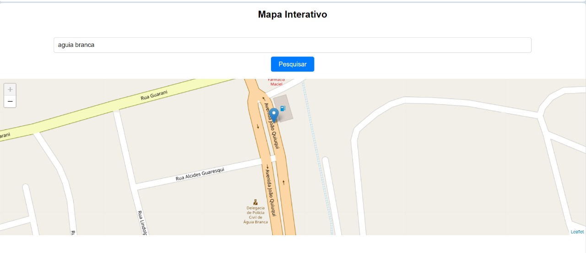

# Mapa Interativo com Leaflet

Um projeto simples de mapa interativo usando a biblioteca Leaflet em conjunto com o OpenStreetMap. Permite que os usuários pesquisem uma localização por cidade e estado, e permite marcar um local puxando assim a longitude e latitude.

## Como Usar

1. Clone ou faça o download deste repositório para o seu computador.

2. Abra o arquivo `index.html` em um navegador da web.

3. No campo de entrada de texto, digite a cidade e o estado que você deseja pesquisar.

4. Clique no botão "Pesquisar" para encontrar a localização.

5. Clique no botão "Marcar Local" para adicionar um marcador vermelho no mapa.

6. Após marcar o local, você pode arrastar o marcador para onde desejar.

7. Clique no botão "Marcar Local" novamente para adicionar uma bolinha verde representando o local marcado.

8. As coordenadas de latitude e longitude do local marcado serão exibidas em um alerta.

## Tecnologias Utilizadas

- HTML
- JavaScript (Leaflet)
- OpenStreetMap
- Nominatim API (para geocodificação)
